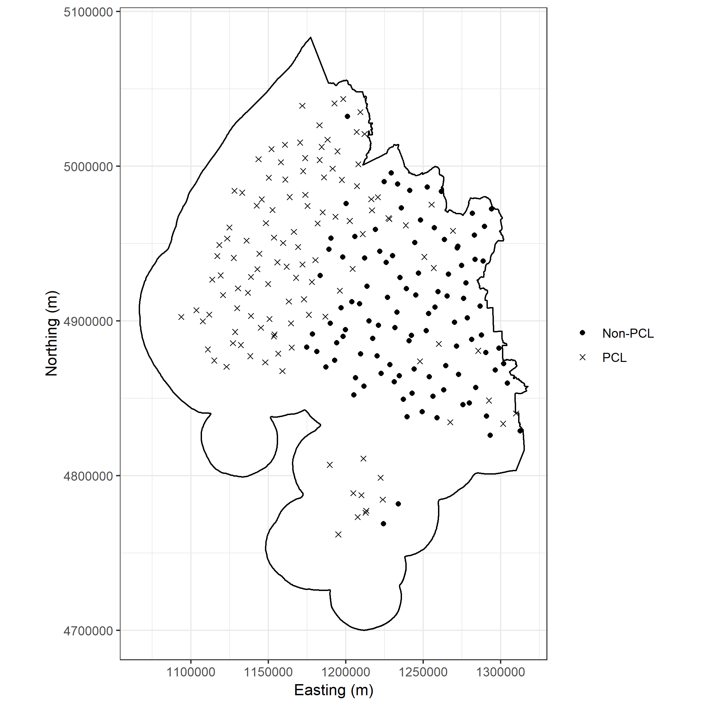
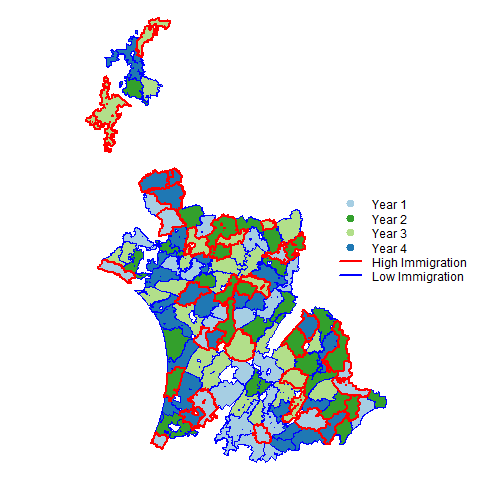
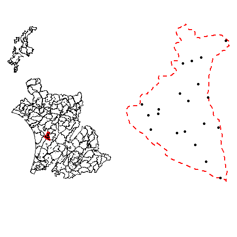

```{r setup, include=FALSE}
knitr::opts_chunk$set(echo = TRUE)
knitr::opts_knit$set(root.dir = NULL)
```

```{r DontRun, include=FALSE, eval = FALSE}
library(rmarkdown)
library(DocRR)
library(knitr)
# setwd("C:/Users/Paul/Documents/Department of Conservation/Regional Councils/RegionalCouncilDesign/Report")
# # render("RegionalSample.Rmd", output_file = "Regional_Monitoring_ProofOfConcept.pdf")
# render("RegionalSample.Rmd", output_file = "RegionalSample.docx")
```

# Introduction{-}

The Department of Conservation (DOC) has developed a National Level Monitoring (NLM) Programme using an
8-km grid at over 1,400 monitoring sites on Public Conservation Land (PCL). The NLM programme focuses on status and trend monitoring at the national scale for key indicators of ecological integrity. This allows DOC to make statistically valid inference over all of PCL. 

Regional councils are responsible for managing biodiversity off PCL within their territorial boundaries. Regional councils have adopted an aligned indicator framework for reporting on ecological integrity and aligned monitoring programmes have been implemented off PCL by Greater Wellington Regional Council (GWRC) and Auckland Council (AC). Considerable effort has gone into aligning monitoring efforts between agencies. The Environmental Monitoring and Reporting group (EMAR) has been established to align environmental monitoring and reporting efforts between central and local/regional government. 

DOC has continued to developed tools and frameworks to support standardised, well designed and coordinated environmental monitoring within DOC. We believe regional councils would benefit from these developments with the view to establishing a coordinated, adaptable and fit-for-purpose approach to monitoring ecological integrity and the effectiveness of biodiversity management in New Zealand. 

## Principles of monitoring {-}

For a monitoring programme to be successful it is important to provide clear, detailed documentation of the design decisions made. We recommend following the approach described in @reynolds2016road to work through the design decision making process. Articulating clear and achievable objectives is critical and drives all of the design decisions that follow. For example, to report on the state of the environment (SOE) would lead to "status and trend" monitoring. Status and trend monitoring may allow for inference about ecological integrity across an area but will not give information about management success in a particular region. If a specific monitoring action is undertaken and we are interested in measuring its success, we would undertake "effectiveness monitoring". Effectiveness monitoring may result in choosing a BACI (Before-After Control-Impact) design. The objectives decide what is measured, where it is measured and how frequently to return. Without clear objectives a monitoring problem will not likely be successful and can be a waste of resources if it fails to provided management and stakeholders without useful information.

Based on the objectives, conceptual models are used to apply expert knowledge and develop the required indicators and measures that are needed to report back on. The indicators and measures that are reported on will identify the target population and sample frame. The target population is defined as the population or resource of interest (e.g. all native forest in the region). The sample frame is a spatial representation of the target population (e.g. the best spatial information available representing native forests in the region). Once the target population and sample frame are defined it is important to account for any logistical constraints (such as accessibility and safe conditions for field crews) as not all areas can be visited safely. A clear definition of the sample frame is important to ensure that the scope of inference is understood. Steep unsafe areas that are not able to be sampled may exclude unique habitats from the sample.

Following choosing what to measure and where it should be measured, sample size and sites needs to determined. Sample size needs reflect the objectives and should be informed on the variability thought to occur in the population being measured. If we suspect biodiversity is reasonably consistent for bird communities on pastures in the Canterbury Plains, then a smaller amount of sampling may be required than when monitoring birds in regenerating native forest. Sampling locations should be drawn to provide an unbiased representation of the population of interest within the sample frame. A probabilistic sample ensures that the sample represents the population as a whole. Convenience or judgement sampling generally does not allow for inference over the entire population. 

## Existing monitoring{-}

The National Biodiversity Monitoring Programme (NBMP) is a systematic sample spread across New Zealand on an 8-km grid with a random start.It builds on the Land Use Carbon Analysis System (LUCAS) forest monitoring programme described by @coomes2002designing. With systematic sampling, effort is proportional to area. Including a random start makes the NBMP a probabilistic sample. This ensures sites are well spread across space. For sampling large regular areas, such as PCL, systematic sampling is very efficient. The spread of effort
improves precision over simple random sampling any time there are strong spatial trends in the population. In the rare case that there is a periodic trend in the population that matches the grid, the sampling can be biased. 
There are roughly 1,400 sites on the 8-km grid that are currently monitored for ecological integrity on PCL. Each year, 20% of the sites (randomly selected) are 
monitored on a non-overlapping rotating schedule. Monitoring in this way puts emphasis on capturing spatial variability over short-term trends. The programme captures long-term trends in ecological integrity through repeated sampling every 5-years. The 8-km grid exists across all of New Zealand and can be extended to Regional Council land, for example Greater Wellington Regional Council. For Nelson or Westland, the largest proportion of Regional Council sites on the 8-km grid are on PCL and monitored as part of NBMP. In other extremes, such as Otago (427 sites off of PCL and 139 on PCL), a large number of grid sites are not on PCL. See Table \@ref(tab:tab1) for the number of sites on and off PCL for each region. Figure \@ref(fig:fig1) shows the 8-km grid for the Southland region which
is more balanced with 47% of the 8-km grid occurring off of PCL.

Although systematic samples are not very flexible, the 8-km grid is very effective for monitoring biodiversity on a large scale. However, the 8-km grid would not be fit-for-purpose for monitoring of fragmented ecosystems with variable areas spread over a broad spatial extent. To facilitate monitoring of management effectiveness DOC has developed a flexible, adaptive approach to monitoring design based on what is known as a Master Sample. A master
sample consists of a large number of sites which can be sub-sampled for a variety of different monitoring programmes. Master Samples are used to coordinate
monitoring between different organizations and have been implemented in the United State (Washington, Oregon and Alaska) as well as Western Canada. Specifically,
the New Zealand Master Sample is a spatially balanced sample with a hierarchical order generated using Balanced Acceptance Sampling (BAS) [@bates2018]. Although spatial spread
is not as good as a systematic sample, the inherent properties of spatially balanced designs offer greater flexibility for varying sample sizes and sample regions than systematic samples. The BAS Master Sample is dense, meaning that there are an infinite number of samples to select
within any sub-region in New Zealand. This allows for it to be relevant at any spatial scale. Using the hierarchical ordering of the Master Sample is how it helps coordinate monitoring.
Sites have a unique ID that matches between different monitoring programmes that have overlapping space and it guarantees that the same sites are selected for both programmes allowing an
automatic sharing of resources. Below shows an example of generating a sample using the Master Sample for the Southland region with a similar sample size to
the 8-km grid. Of note, the Master Sample can be combined with the 8-km grid for estimation as both are unbiased area proportional samples, and this has been shown by simulation [@bates2018].
Using the Master Sample ensures that objective probabilistic monitoring takes places that integrates with future DOC monitoring work and the existing National
Biodiversity Monitoring Programme. In fact, the Master Sample used on PCL explicitly integrates the 8-km grid into any new monitoring programmes.


```{r tab1, echo = FALSE, warning = FALSE}
library(knitr)
tab <- read.csv("data/Table.csv")
names(tab) <- c("Region", "Off-PCL", "On-PCL")
tab <- rbind(tab, data.frame(Region = "Total", "Off-PCL" = sum(tab["Off-PCL"]), "On-PCL" = sum(tab["On-PCL"]), check.names = FALSE))
tab$Total <- rowSums(tab[,2:3])
kable(tab, caption = "Number of sample locations on the 8-km grid by PCL/non-PCL.")
```


```{r fig1,echo = FALSE, warning = FALSE,messages = FALSE,fig.cap="Southland Region Example of the 8-km grid which yields 494 sites."}

knitr::include_graphics("images/Tier1Southland.png")

```


<!--  -->

```{r fig2,echo = FALSE, warning = FALSE,messages = FALSE,fig.cap="Southland Region Example of the Master Sample matching sample size as the 8-km grid."}



```


<!--  -->

## Objectives{-}

Regional councils have statutory responsibilities for monitoring the state of the environment (SOE) and the effectiveness of policies and rules on the maintenance of indigenous biodiversity.

Objectives drive monitoring programme design. For the purposes of this document we assume 2 main objectives for regional council biodiversity monitoring. 

1. To provide unbiased assessment of the SOE based on indicators from the regional council indicator framework.

2. To determine the effectiveness of policy and management interventions. 

This document describes an approach for biodiversity monitoring for regional councils. It builds on developments made by DOC building a monitoring and reporting system. We will present a recommended approach for monitoring which meets the objectives stated above. We will demonstrate the approach through the use of scenarios in different regions. 

# Recommended monitoring design for regional councils{-}

In order to integrate monitoring between the Regional Councils and DOC we recommend implementing the New Zealand Master Sample [@bates2018]. This document compares
and contrasts the advantages of the Master Sample over adopting the 8-km grid for Regional Councils who manage diverse ecosystems mixed with 
protected habitats, industry and urban areas. We describe the two designs in the context of the sampling requirements

* Stratification (Forest, Urban, Pasture)
* Multiple Spatial Scales
* Adaptability (inaccessible sites, changing resources etc.)
* Incorporate legacy monitoring
* Coordination between MfE and DOC.

## Stratification{-}

Regional Councils are specifically interested in monitoring all non-PCL in their area, which consist of a diverse matrix of ecosystems and land use types.
Stratification is a powerful tool to improve precision of a sample by focusing more effort in areas that are more variable. 
For instance, native forest will likely be variable across the landscape for bird diversity than pasture. A bird monitoring programme that proportionally over represents
forest and under represents pasture will improve precision over a programme with the same sample size but ignoring the difference. Using area proportional sampling, pasture 
would inherently get a larger number of sites selected than is optimal for making inference on both pasture and native forest. In this case, stratification would improve the precision of 
the estimate for the entire region.

Systematic sampling such as the 8-km grid can stratified by changing the grid size in each region. For example, pasture could be sampled every 10-km while native forest every 6-km.
While in theory this would be okay, in practice it may perform poorly as the native forest may be patchy and surrounded by pasture. Depending on the landscape,
achieving a feasible sample size for the two different stratum may be difficult. In addition to this, once the 8-km grid is deviated from it removes the explicit integration with
DOC's existing national programme, which would be the basis for using systematic sampling over a more modern flexible sample method in the first place. Choosing grid size of 4-km and 16-km would allow for the continued integration of the 8-km grid with intensified, or reduced programmes but provide less flexibility to adjust sample effort. 

Using the Master Sample to stratify is very simple. Choose the number of sites in each stratum and then select the first sites in each stratum based on their ordering. Any sample size
can easily be achieved and any stratum, no matter how small area it is will have as many sample sites as required.
Traditional statistical theory recommends that strata should be chosen that are constant through time (e.g. not subject to change). Using forest and non-forest can be an issue when some non-forested areas are recovering habitat and may at some point become defined as forested. The Master Sample is flexible to account for changing ecosystems to choose strata that are efficient but the spatial extent may need to be adapted in the long-term.

## Adaptability{-}

Heterogeneity in ecosystems/land cover means there are many sites which may be rejected due to lack of access to private land or the randomly selected site lands
directly on top of a building. Objective, statistically robust methods must be set up to allow for establishing sites in feasible areas when the original sample 
has to be rejected. The NBMP has strict rules to relocate sites from the 8-km grid randomly. The Master Sample has an explicit method
using the hierarchical ordering to relocate sites that fail to fall onto accessible areas. If a site is rejected, a new site in order is available to replace it
maintaining overall spatial balance. Instead of the user needing to re-establish the site randomly, they move down the list of available sites adding the new one and removing the missed site.
The procedure is simple and requires nothing more than identifying that a site is not able to be sampled.

In the same sense, if a monitoring programme stratifies by forest, pasture, urban and other, then it is possible through new management regimes that the pasture is actively managed and moves from pasture to recovering shrub (other) and then finally to forest. These sites may have their own specific programme to monitoring progress of the reforestation. Otherwise, through the hierarchical ordering of the Master Sample, a new pasture site is established and then depending on the existing sites ordering it is either dropped from the sample or another site in the "other" category is dropped making space for the continued monitoring of this site.

## Legacy Monitoring{-}

Often, there are existing monitoring networks that have historical information and/or are currently monitored. Incorporating these sites into
new monitoring programmes improves estimation of trends and can reduce costs if the sites are already resourced. These legacy sites should be
monitored using consistent methodologies and be sampled with some probability. Using the 8-km grid, legacy sites can be included if they fall within some
set distance to a grid point. The grid point site can be replaced with the legacy site. This was implemented by the National Biodiversity Monitoring Programme. 
In contrast, the Master Sample explicitly includes legacy monitoring. If legacy monitoring in an area is adequate, then no Master Sample site may even be used.
The Master Sample is just used to augment sampling to ensure that as a whole the region is sampled at the intensity required by the programme. If a catchment
has a historical program of 10 sites and that catchment makes up 10% of the monitoring area, then a area proportional number of those sites will be randomly selected
to be included into the program and the Master Sample is then used to augment areas with no existing effort.

## Spatial Scales{-}

For many regional councils it is important have a monitoring programme that works at different spatial scales. Some monitoring objectives will include
the ecological response to specific management action. The 8-km grid is set up for status and trend monitoring at a large scale and does not
provide information at a local level. Increasing the sample size of the grid by reducing the grid size is possible and would allow for
localized monitoring. However, as discussed above it would no longer integrate with the larger DOC monitoring program and would then simply be a systematic sample.
Although systematic sampling is an effective way to distribute sampling effort, modern methods of generating probability designs with spatial balance add flexibility and
to the systematic design and are an overall improvement. The Master Sample is able to integrate with the different spatial scales of a monitoring programme making use of the
fact that it is dense (infinite sites at any scale) and has a hierarchical ordering to ensure that sites selected at the larger scale are matched with the localized monitoring
reducing overall effort at the different spatial scales.

## Coordination{-}

When the 8-km grid is effective and feasible for a regional council to implement then it is very easily coordinated with DOC and other monitoring programmes.
This has been shown by Wellington Regional Council working with DOC to monitoring biodiversity on the 8-km grid. When more flexible monitoring is required, the 
8-km grid no longer explicitly coordinates monitoring unless multiples of the grid sized are used. In this case intensifying the sample to a 4-km grid or reducing it
to a 16-km grid still allows it to fit directly into the overall national grid. However, this either doubles or halves the sample size which may create unfeasible options.
The Master Sample was created with the sole purpose of coordinating monitoring. It covers all terrestrial habitats in New Zealand and 

# Conclusions{-}

Although the 8-km grid is an effective sample design for DOC's purpose and some Regional Councils. It may be unfeasible or
too inflexible to work for everyone. It is our opinion that using the Master Sample to coordinate and implement monitoring will
both integrate with DOC's current national monitoring programme and DOC's implementation of the Master Sample as well as 
meet any sampling requirements and objectives put forth by the councils. For this reason we recommend that
implementing the New Zealand Master Sample for Regional Council biodiversity monitoring programmes.

The next development for DOC and the New Zealand Master Sample is to incorporate freshwater explicitly into this same design. A recent publication using
Halton Iterative Partitioning [@robertson2018] allows for the sampling of a linear network within the current Master Sample framework. The benefit here is that
freshwater sites selected by the Master Sample will be paired spatially to terrestrial sites. Although the preliminary work on this has been completed to test feasibility,
it is an ongoing research project to finalize the best approach for sampling the linear network within a selected Halton Frame.

# Case Studies

## Southland

There are 233 sample locations from the 8-km grid occurring off PCL in the Southland region (Table \@ref(tab:tab1)). Given no resource constraints implementation of monitoring at each of these sample locations would be optimal for monitoring and reporting status and trend for the Southland Region and integrating seamlessly with DOC's NBMP. We recognise that resource constaints are a major impediment to uptake of aligned monitoring for many partner agencies, including Southland Regional Council. In order to scale sample size to match resource constraints using systematic sampling approaches the 8-km grid could be reduced to a 16 or 32-km grid, this would reduce the sample size in the Southland Region from 233 to 116 and 58 respectively. Using the Master Sample to derive sample locations for the Southland Region is conceptually simpler and more flexible than scaling a systematic sample based on the 8-km grid. Simply use all of the Southland region not covered by PCL and apply the Master Sample to derive **N** sample locations. Additionally, site specific monitoring can be derived from the Master Sample. This means sample locations for regional status and trend monitoring overlapping with intensively managed sites can contribute to site specific estimates of monitored parameters. If more (or less) sample locations are needed in the future this can be easily accommodated without compromising the initial sample locations implemented from the Master Sample.

In this case study the benefit of using the Master Sample over the 8-km grid is that; 

1. Sample size can be flexibly scaled to adjust to resource constraints.
2. Regional monitoring of status and trend contributes explicitly to monitoring of intensively managed sites.
3. The Master Sample can be used to intensify regional status and trend monitoring in sites of specific interest.


## Horizons Regional Council

Landcare Research developed a possum monitoring plan on behalf of Horizons Regional Council (Horizons) to inform on approximately 1.2 million hectares of 
area that is managed for possums. The region is broken into Possum Control Operations (PCO) which are selected for management, see Figure \@ref(fig:fig3). The primary monitoring 
objectives stated are [@gormleywarburton] 

* "Whether the PCO programme is achieving its aim of maintaining possum populations below a specified target within possum habitat across the region."
* "The likelihood that the possum density in each PCO is being maintained below a specified target."

In this case it is important that the monitoring plan informs at both a regional and PCO level to address the overall success of management against
the success of an operation. A stratified random design using the PCOs was recommended with non-overlapping rotating panels. The PCO is treated as the sampling unit 
and transects are repeated within selected PCOs in order to get a reliable PCO estimate. There is a resource trade-off between sampling effort within a likely 
somewhat heterogeneous PCO and across the entire region which will improve regional level estimates but may not inform directly on the success of a particular 
operation. Selected PCOs are stratified by the immigration pressure of possums into the area. Areas with high immigration pressure (n = 37 of 120 PCOs) make up 31% 
of all PCOs. We will follow one of the proposed design options for this example shown in Table \@ref(tab:tabpos). Stratification ensures that each year an even number of both high and
low immigration PCOs are selected at roughly the proportion they make up of the sample. The non-overlapping panels define the time of re measurement of each PCO which is on a 4
year schedule such that after 8-years each PCO will have been monitored twice estimating trend across the population. Note, that this is an equivalent re measurement method to 
the NLM monitoring programme and that general trends with some variability can be estimated after several years and likely reliable trends before the 8-year period is completed.
We will not show how systematic sampling will work for the proposed design as it will not at the 8-km intensity. Instead we will describe the design in the context
of the New Zealand Master Sample.

```{r tabpos, echo = FALSE, warning = FALSE}
	tab.pos <- data.frame(Year = c(1:4, "Total"), `High Immigration` = c(9,9,9,10,37), `Low Immigration` = c(21, 21, 21, 20, 87), "Total" = c(30, 30, 30, 30, 120))
	kable(tab.pos, col.names = c("Year", "High Immigration", "Low Immigration", "Total"), caption = "Design option that is proposed by @gormleywarburton.")
```

To implement the monitoring programme using the Master Sample we first sample the discrete PCO units by giving them 
a spatially balanced order for selection using the Halton Frames defined by the bounding box and random seed of the Master Sample [@robertson2018]. 
Once we order the PCOs the first 9 high immigration PCOs become the year 1 selected PCOs and the next 10-19 become year 2 etc. until all PCOs are 
selected and given a sampling year. Within each PCO we then select 20 different sites using the Master Sample. In essence, this is how the design described by 
@gormleywarburton would be implemented using the Master Sample. 

Figures \@ref(fig:fig3) and \@ref(fig:fig4) show the panel designs based on selection using the Halton Frames and the Master Sample followed by an example
PCO (Mt Stewart) with 20 sites selected within. Note that the site selected is the beginning of a possum line that would start at a random
bearing away from the starting point. Each individual site is numbered based on the order of the Master Sample. The results is a reasonably 
well spread sample with each PCO as well as between PCOs on an annual basis. If sites are inaccessible or non target, the ordering of the Master
Sample can be used to add new sites that maintain good spatial spread in the area.


```{r fig3,echo = FALSE, warning = FALSE,messages = FALSE,fig.cap="Each year of PCOs that would be selected under the example monitoring programme."}



```

<!--  -->


```{r fig4,echo = FALSE, warning = FALSE,messages = FALSE,fig.cap="An example of Mt Stewart PCO monitoring sites selected."}



```


<!--  -->

Although this design doesn't appear any different than what is proposed in by @gormleywarburton as far as selection of PCO or sites within,
it is an important illustration that the Master Sample is flexible to adapt to any spatial site selection providing a potentially more
efficient design through spatial balance. The largest benefit of implementing the Master Sample here instead of a simple random sample or
a local spatially balanced sample is that sites are inherently matched through their unique ordering and therefore effort can be shared between monitoring
programmes and it can help Regional Councils work together. The intention of the Master Sample is to be flexible for any needs for terrestrial spatial surveys
but most importantly to help coordinate (improve efficiency) of monitoring across New Zealand.

#References{-}
