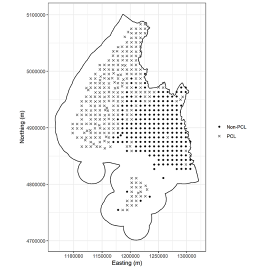

```{r setup, include=FALSE}
knitr::opts_chunk$set(echo = TRUE)
knitr::opts_knit$set(root.dir = NULL)
```

# Executive Summary{-}

* Regional councils and central government agencies are collaborating to implement an integrated approach to the monitoring and reporting of biodiversity indicators.

* The Department of Conservation has developed a Master Sample for biodiversity monitoring across all of New Zealand. A Master Sample explicitly coordinates monitoring by 
ensuring scalability across spatial scales as well as explicitly keeping track of sampling effort to allow reduced costs when sampling areas and
objectives overlap. The sample itself is created from Balanced Acceptance Sampling (BAS) which is a modern spatially balanced design combining the benefits of both systematic
and simple random sampling.

* The Master Sample approach can both augment any existing monitoring programme based on the 8-km systematic grid, or should be considered as a design basis for future monitoring programmes. Combining data from the 8-km grid and the Master Sample does not negatively impact the overall inference about the population [@bates2018]. 
This is for both sample augmentation to intensify sampling effort from 'Status and Trend' to 'management effectiveness' monitoring, 
as well as for contiguous regions where one may implement the 8-km grid and then collaborate with a region that implements the Master Sample.

* Due to the heterogeneity of forests in New Zealand and the homogeneity of productive land use types that make up a large portion of Regional Council lands, 
stratification could be implemented to decrease cost while not negatively impacting the overall inference required for State of the Environment reporting. For example, Southland Regional Council implementing the 8-km grid would need to monitor 218 sites. Using stratification for croplands and other areas that are highly 
impacted by human use, we would recommend a sample size of 165 (53 fewer sites). Under this scenario, forest and native habitat sample size is determined by the sampling intensity derived from the 8-km grid.

* The 8-km systematic grid utilised the best approaches available at the time for the monitoring of widespread ecological resources. Recent developments in spatially balanced sampling methods offer the benefits of systematic sampling with additional utility. The Master Sample is flexible and can be tailored to the needs of individual agencies while maintaining design robustness. This flexibility includes dynamic adjustment of sample size to adjust to fluctuating resources or changes in objectives and simple approaches for site replacement when access or safety constraints mean a sample location cannot be accessed.

*	We suggest the Master Sample is an improved platform for coordinating SOE monitoring which readily integrates with existing central and local government SOE monitoring. 

\newpage

# Introduction{-}

The Department of Conservation (DOC) has developed a National Level Monitoring (NLM) Programme as part of 
the National Biodiversity Monitoring Programme (NBMP) system, using an
8-km grid at ~1,400 monitoring sites on Public Conservation Land (PCL). The NLM programme focuses on status and 
trend monitoring at the national scale for key indicators of ecological integrity. 
DOC is then able to make statistically valid inference across the entire PCL and report on the State of the Environment (SOE). 

Regional councils (RCs) are responsible for managing biodiversity off PCL within their territorial boundaries and have adopted an indicator 
framework for reporting on ecological integrity aligned with DOC and the NBMP.
Monitoring programmes have already been implemented off PCL by Greater Wellington Regional Council (GWRC) and Auckland Council (AC). 
Considerable effort has gone into collaborating monitoring between agencies such as the Environmental Monitoring and Reporting group (EMAR); 
established to coordinate environmental monitoring and reporting efforts between central and local/regional government. 

DOC has continued to develop tools and frameworks to support standardised, well designed and coordinated environmental monitoring within New Zealand. 
We believe RCs would benefit from these developments with the view to establishing a coordinated, adaptable and fit-for-purpose 
approach to monitoring ecological integrity and the effectiveness of biodiversity management in New Zealand. @bates2018 established the rigorous design
methods for coordinated terrestrial monitoring in New Zealand. The purpose of this document is to introduce the Master Sample [@bates2018] 
in the context of Regional Council SOE monitoring and reporting along with basic design principles to understand the benefits of implementing an integrated monitoring programme between
DOC and each RC.

This document is to introduces the Master Sample [@bates2018] in the context of Regional Council SOE monitoring and reporting along with basic design principles to understand the benefits of implementing an integrated monitoring programme between DOC and each RC. 


## Principles of monitoring{-}

For a monitoring programme to be successful it is important to provide clear, detailed documentation of the design decisions made. 
We recommend following the approach described in @reynolds2016road to work through the design decision making process. 
Articulating clear and achievable objectives is critical and drives all of the design decisions that follow. To report on SOE similar to NLM,
we define it as "status and trend" monitoring focussing on large spatial scales (the entire region) and long-term trends (5-10 years).
Status and trend monitoring may allow for inference about ecological integrity across an area but will not necessarily give information about 
short-term management effectiveness in a particular area unless there is a very significant response in the population. 
If a specific monitoring action is undertaken and we are interested in measuring its 
success, we would undertake "effectiveness monitoring". Effectiveness monitoring may result in choosing a BACI (Before-After Control-Impact) design. 
The objectives decide what is measured, where it is measured and how frequently to return (spatial and temporal replication). 
Without clear objectives a monitoring programme is unlikely be successful and can be a waste of resources if it fails to provide management and stakeholders with useful information.

Conceptual models should be used to apply expert knowledge to;

1. Identify the indicators and measures that are required to report on progress and

2. Define the target population and sample frame.

The target population is defined as the population or resource of interest (e.g. all native forest in the region). The sample frame is a spatial representation of the target population 
(e.g. the best spatial information available representing native forests in the region). Once the target population and sample frame are defined it is 
important to account for any logistical constraints (such as accessibility and safe conditions for field crews) as not all areas can be visited safely. 
A clear definition of the sample frame is important to ensure that the scope of inference is understood. Steep unsafe areas that are not able to be sampled may exclude unique habitats from the sample. In particular for RCs, private land access may be restricted and the sample frame will be limited to areas where access is possible.

After choosing what to measure and where it should be measured, sample size/site selection is undertaken. Sample size should reflect the objectives 
and should be informed on the variability thought to occur in the population being measured. For example, if we assume biodiversity is reasonably consistent for bird 
communities on pastures in the Canterbury Plains, then a smaller amount of sampling may be required than when monitoring birds in regenerating native 
forest. Sampling locations should be drawn to provide an unbiased representation of the population of interest within the sample frame. 
A probabilistic sample ensures that what is observed represents the population as a whole. Convenience or judgement sampling generally does not allow 
for inference over the entire population.

## Objectives{-}

Regional councils have statutory responsibilities for monitoring the SOE and the effectiveness of policies and rules on the maintenance of indigenous biodiversity.

For the purposes of this document we assume the main objective is

1. To provide unbiased assessment of the SOE based on indicators from the regional council indicator framework.

However, the Master Sample framework provided allows for integrating effectiveness monitoring into existing SOE monitoring

2. To determine the effectiveness of policy and management interventions. 

## Interagency collaboration for State of Environment Monitoring and Reporting{-}

RC's are collaborating to achieve a coordinated approach to regional SOE monitoring. An important consideration is how to effectively integrate with existing monitoring programmes such as the NLM programme. DOC requires effectiveness monitoring to integrate seamlessly with the NLM programme and also  be coordinated across the organisation. 

To provide for this DOC, in collaboration with the University of Canterbury (UoC), has developed the New Zealand Master Sample [@bates2018]. The New Zealand Master Sample (NZMS) utilises a spatially balanced sampling method to provide sample designs which take the spatial balance advantages provided by systematic sampling (such as the 8-km grid), and extend these advantages by providing utility for dynamic adjustment of sample size and site replacement (when sample locations are unsafe, inaccessible or non-target, i.e. a built surface which precludes sampling relevant indicators). @bates2018 demonstrates that sample designs implemented using the NZMS integrate effectively with the 8-km grid while providing enhanced flexibility. The NZMS is being increasingly used within DOC and some partner agencies for sample design for effectiveness monitoring programmes. 

RC's are confronted with obstacles to implementing regional SOE programmes to which DOC is not subject. These restrictions include the need to sample on private land, often without guaranteed access, diverse land cover types (indigenous, productive, urban etc.) and varying resource levels as determined by rateable population. We believe the NZMS can provide solutions to these obstacles so that individual RC's can scale monitoring to available resources and replace sample locations as necessary should they occur in areas with restricted access or non-target land use types such as urban/industrial areas.  

In order to integrate monitoring between the RC's and DOC, and take advantage of recent developments in statistical sample design, we recommend implementing regional SOE monitoring using the NZMS [@bates2018]. 

The following sections describe the NZMS and demonstrate through case studies how the NZMS could be used as a design basis for regional and national SOE monitoring while integrating with existing monitoring efforts (such as the NLM programme). 

<!-- over adopting the 8-km grid for RCs who manage diverse ecosystems mixed with  -->
<!-- protected habitats, industry and urban areas. -->

<!-- A Master Sample -->
<!-- is a large number of sampling locations which have shared properties such that subsamples explicitly accomodate coordination on multiple spatial scales.  -->
<!-- This document compares and contrasts the advantages of the Master Sample over adopting the 8-km grid for RCs who manage diverse ecosystems mixed with  -->
<!-- protected habitats, industry and urban areas. We describe the two designs in the context of the sampling requirements -->

<!-- * Stratification (Forest, Urban, Pasture) -->
<!-- * Multiple Spatial Scales -->
<!-- * Adaptability (inaccessible sites, changing resources etc.) -->
<!-- * Incorporate legacy monitoring -->
<!-- * Coordination between MfE and DOC (LUCAS and NLM *formerly known as Tier 1*) -->

<!-- As mentioned in the objectives, the Master Sample approach is flexible enough to be intensified locally for effectiveness monitoring.  -->


#Monitoring design for Regional Councils{-}

The following section describes the NZMS and its application for SOE monitoring in contrast to the 8-km grid. We describe the NZMS and the 8-km grid and describe how each approach copes with differing aspects of monitoring programme design such as integration of legacy monitoring, stratification to optimise sample allocation and contrast the scalability and adaptability of the two approaches. We then demonstrate these aspects of monitoring design by the use of case studies.     

## New Zealand Master Sample{-}

When agencies are designing rigorous monitoring programmes, the data can be aggregated with low risk
of bias when the survey design is taken into account. However, it is a difficult task to aggregate data from disjoint surveys with unknown scales
of inference and often uncertain probabilistic/judgement design. A Master Sample consists of a large set of sample locations that can be subsampled from for different monitoring purposes. If used by different agencies and initiatives it ensures that a consistent design methodology is used. This ensures monitoring data can be seamlessly aggregated at larger scales for regional/national evaluation. Local monitoring efforts can be readily used to inform status and trends at regional and national scales. 

The NZMS was developed by DOC [@bates2018] in order to augment existing national level
programmes for the purpose of monitoring management effectiveness at multiple spatial scales. A key benefit of a Master Sample is that it helps
coordinate monitoring within and between agencies. DOC required this to both integrate monitoring effort between district, regional and national
offices and externally with RCs and MfE. NZMS is a spatially balanced sample with a hierarchical order generated using Balanced Acceptance Sampling (BAS) [@bates2018]. It specifically provides a way of ensuring rigorous sample design which can readily adapt to fluctuating resource levels, changes in boundaries/area of interest while accomodating pragmatic considerations of monitoring implementation such as the need to replace sample locations due to access/logistical constraints. 
<!-- Sample locations have a unique ID determined by the hierachical ordering. One of the important properties of spatially balanced samples is that any ordered subsample is by definition statistically representative of the sub-region of interest. Therefore .  -->

While the NZMS facilitates coordination through site selection, successful implementation requires agencies communicate 
about their monitoring programmes and use aligned indicators, measures and methods. 
See the Pacific Northwest Aquatic Monitoring Partnership (https://www.pnamp.org/static-page/what-tools-do-we-offer) for an example of a Master Sample used for coordinating 
freshwater monitoring in Washington State, USA. 

<!-- As mentioned above, if regions overlap then sites can be shared based on this ordering -->
<!-- which maintains an overall BAS sample within and across the sampling areas. Figure \@ref(fig:tasman) shows how the NZMS can be used to explicitly -->
<!-- coordinate monitoring for DOC at multiple spatial scales as well as augment the 8-km grid. -->

<!-- ```{r tasman,echo = FALSE, warning = FALSE,messages = FALSE,fig.cap="Example using the Master Sample from @bates2018 for Abel Tasman National Park combining National Level Monitoring (Tier 1), Sites from Tier 2 National Master Sample, and a local monitoring programme.", fig.height=7, fig.width=7} -->
<!-- knitr::include_graphics("images/Tasman-eps-converted-to.pdf") -->
<!-- ``` -->

## Existing Monitoring Programmes{-}

The NLM is a systematic sample spread across New Zealand on an 8-km grid with a random start. 
It builds on the Land Use Carbon Analysis System (LUCAS) forest monitoring programme described by @coomes2002designing. With systematic sampling, 
effort is proportional to area. Including a random start makes the NLM a probabilistic sample. This ensures sites are well spread across space
and representative of the entire PCL. The spread of effort improves precision over simple random sampling any time there are strong spatial trends 
in the population.
There are roughly 1,400 sites on the 8-km grid that are currently monitored for ecological integrity by DOC. Each year, 20% of the sites (randomly selected) 
are monitored on a non-overlapping rotating schedule. Designing the survey this way puts emphasis on capturing spatial variability versus short-term trends. 
The programme captures long-term trends in ecological integrity through repeated sampling every 5-years. 

The 8-km grid exists across all of 
New Zealand and has been implemented off PCL in the Greater Wellington and Auckland Regions. Systematic sampling ensures an even spread of sample effort across the region of interest (NZ terrestrial boundaries). Therefore each RC will have a proportion of 8-km grid locations roughly equal to their proportion of NZ land area. Thus for the West Coast Region , the largest proportion of Regional Council 
sites on the 8-km grid are on PCL and monitored as part of NLM (84% PCL). In other extremes, such as Otago , a large number 
of grid sites are not on PCL (497 sites off of PCL and 92 on PCL). See Table \@ref(tab:tab1) for the number of sites on and off PCL for each region. Figure \@ref(fig:fig1) shows the 8-km 
grid for the Southland region which is more balanced with 47% of the 8-km grid occurring off of PCL.


```{r fig1, warning=FALSE, message=FALSE, echo=FALSE, fig.cap="Southland Region Example of the 8-km grid which yields 495 sites, 277 of which are are on PCL and monitored by the NLM, and 218 which Southland Regional Council would be responsible for.", out.width='100%'}

```

<!-- Although systematic samples are not very flexible, the 8-km grid is very effective for monitoring biodiversity on a large scale.  -->
<!-- However, the 8-km grid would not be fit-for-purpose for monitoring of fragmented ecosystems with variable areas spread over a broad spatial extent.  -->
<!-- To facilitate monitoring of management effectiveness DOC has developed the Master Sample. These have also been implemented in the United States (Washington, Oregon and Alaska)  -->
<!-- as well as Western Canada.  Although spatial spread is not as good as a systematic sample, the inherent properties of spatially balanced designs offer greater flexibility for  -->
<!-- varying sample sizes and sample regions than systematic samples. The BAS Master Sample is dense, meaning that there are an infinite number of samples to select -->
<!-- within any sub-region in New Zealand. This allows for it to be relevant at any spatial scale, making it easy to intensify for different monitoring objectives.  -->
<!-- Using the Master Sample ensures that objective probabilistic monitoring takes places that integrates with future DOC monitoring work and the existing National -->
<!-- Biodiversity Monitoring Programme. In fact, the Master Sample has been designed for to explicitly integrate the 8-km grid into any new monitoring programmes. -->

```{r tab1, echo = FALSE, warning = FALSE}
	tab1 <- read.csv("table1.csv")
	names(tab1) <- c("Region", "On PCL", "Off PCL", "Total")
	knitr::kable(tab1, caption = "Number of sample locations on the 8-km grid by On-PCL/Off-PCL for each region.", booktabs = TRUE)
```

<!--  -->


## Stratification{-}

Regional Councils are specifically interested in monitoring all non-PCL in their area, which consist of a diverse matrix of ecosystems and land use types.
Stratification can be used to improve precision of a sample by focusing effort in areas that are more variable. 
For instance, bird or plant diversity is likely to be more variable across the landscape in native forest than pasture. A bird monitoring programme that proportionally over represents
forest and under represents pasture will improve precision over a programme with the same sample size which ignores the difference in variability between landcover types. Using area proportional sampling, pasture 
would inherently get a larger number of sites selected than is optimal for making inference on both pasture and native forest. In this case, stratification can improve the precision
or maintain the same precision for estimates of the entire region at reduced cost .

For the case studies described in this document we examined which land use cover types that do not occur frequently on PCL based on the LUCAS 
Land Use Map and and where stratification could improve precision for reporting when compared to an unstratified systematic sample. We defined two classes for stratification; Strata 1 - Native and Strata 2 - Impacted.  Impact includes Settlements, Annual and Perennial Cropland and High producing Grassland land cover types. Native is defined as the rest such as Forest, Shrubland etc and is not truly "native" as it incorporates planted forest and other introduced land covers. Table \@ref(tab:tab2) shows how many samples in the NLM programme occur in each of these tow Strata. Table \@ref(tab:tab3) breaks down what proportion of each Region is made up of each potential strata.

Varying sample effort in each strata can be accommodated when using the 8-km systematic sample, but sample size can only be adjusted by halving or doubling the grid size, i.e. to intensify sample effort a grid size of 4-km would be needed, to reduce sample effort a 16-km grid size would need to be employed.  

In contract, stratification within the NZMS is simpler and more flexible. Once strata are defined for the design, the sample size (see below)  or number of sites in each stratum required for a set level of precision are chosen.

Traditional statistical theory recommends that strata should be chosen that are constant through time (e.g. not subject to change). 
Using forest and non-forest can be an issue when some non-forested areas are recovering habitat and may at some point become defined as forested. 
The NZMS can account for changing ecosystems but the spatial extent may need to be adapted in the long-term, adding more complexity to the survey.
Both the 8-km grid and the NZMS can accommodate varying sample effort by strata, however the NZMS provides for greater flexibility in dynamic adjustment of sample size.

<!-- The biggest issue here is the inflexbility of sytematic sampling to allow the addition or removal of several sites resources change. -->
<!-- Depending on the landscape, achieving a feasible sample size for the two different stratum may be difficult.  -->
<!-- In addition to this, once the 8-km grid is deviated from it removes  -->
<!-- the explicit integration with DOC (NLM) and MfE's (LUCAS) existing national programme, which would be the basis for using systematic sampling over a more modern flexible sample method in the first place.  -->

\newpage
\blandscape

```{r tab2, echo = FALSE, warning = FALSE, message = FALSE}
 library(kableExtra)
 	tab2 <- read.csv("table2.csv")
 	names(tab2) <- c("Region", "Total", "Total native", "DOC sampling already", "Requires RC sampling", "Requires RC sampling","Total number of 8-km that would require RC to sample$\\\\dagger$")
 	knitr::kable(tab2,format = "latex" ,caption = "Number of sample locations if 8-km grid implemented. Seperated by strata, sampled by DOC already versus those that require sampling by Regional Councils.", booktabs = TRUE, escape = F, col.names = c("Region", "Total", "Total native", "DOC sampling already", "Requires RC sampling", "Requires RC sampling","Total number of 8-km that would require RC to sample\\textsuperscript{$\\ddag$}"))%>%
 	  kable_styling() %>%
 	  add_header_above(c(" " = 2, "Strata 1 = Native*" = 3, "Strata 2 = Impacted\\\\textsuperscript{$\\\\dagger$}" = 1," " = 1), escape = F)%>%
 	  column_spec(1, width = "7em")%>%
 	  column_spec(2, width = "1em")%>%
 	  column_spec(3, width = "4em")%>%
 	  column_spec(4, width = "5em")%>%
 	  column_spec(5, width = "5em")%>%
 	  column_spec(6, width = "5em")%>%
 	  column_spec(7, width = "8em")%>%
 	  footnote(symbol = c("Strata 1 = Native which includes Forest, Shrubland, Planted forest and other introduced land covers.","Strata 2 = Impacted which includes Settlements, Annual and Perennial Cropland and High producing Grassland.","DOC complete no sampling of 8-km sites in the Impacted strata (Settlements, Annual and Perennial Cropland and High producing Grassland."), escape = F,threeparttable = T)


 
```

\elandscape
\newpage

```{r tab3, echo = FALSE, warning = FALSE}
	tab3 <- read.csv("table3.csv")
	names(tab3) <- c("Region", "Area (km)","% PCL","% Off-PCL","% Native","% Impacted")
	
	 knitr::kable(tab3, caption = "Basic breakdown the area contained within each Regions and percentage of this area that is a. On-PCL vs Off-PCL and b. Native vs Impacted", booktabs = TRUE, escape = F,col.names = c("Region", "Area(km\\textsuperscript{2})","\\%PCL","\\%Off-PCL","\\%Native","\\%Impacted"))
```

##Determining sample size{-}

Choosing a sample size is frequently one of the most complicated parts of designing a survey. We consider that the NLM programme has been successful
for SOE monitoring on the PCL. For this reason, in our case studies below we have used the NLM sample size as a benchmark for Native areas. Determining the level of sampling effort required for Impacted areas required a different approach.  

There are many ways to choose sample size within each stratum. Commonly, a budget may define the sample size but this is risky if it doesn't resource monitoring properly, rendering the programme a poor investment. As described above, a better approach is to choose a sample size that meets some requirement of precision based on the study objectives. For this, pilot data or expert opinion to may be used to inform how many locations to sample from (and how frequently). 

Another approach and used by DOC, was to use existing monitoring data from the NLM programme to investigate the variability of bird abundance in each of the strata. These data were provided by Greater Wellington Regional Council (GWRC). We investigated Bellbird, Fantail, and Grey Warbler bird abundance, to see how the different species varied between the two strata (Native vs Impacted).  

We observed that
the standard deviation of these birds was roughly twice as large for Native habitats vs Impacted. Using the Neyman Allocation [@strata] we can assign
a sample size for the Impacted region. For standard deviation $s_{Impacted} = 1$ and $s_{Native} = 2$ and $n_{Impacted}$ unknown but $n_{Native}$ equal to the number
of 8-km grid sites on Native habitat in each council we can define the total sample size as
$$
	n = n_{Native}/(2 \times P_{Native}/(2 \times P_{Native} + 1 \times P_{Impacted})).
$$
$P_{Native}$ and $P_{Impacted}$ are the proportion of area in the Region are Native or Impacted. This result is intuitive because sample size depends on
area (the 8-km grid) and heterogeneity (how much bush or farmland is in the Region). 

Using the expected variability, we estimated sample sizes in each region if we use the NZMS and stratification (Table \@ref(tab:tab4)).  Note that for small regions such as Nelson, sample sizes in some stratum are too small to be practical and some minimum sample sizes will be needed. Statistically 3 samples is the bare minimum but we would recommend a minimum of 5 samples in order to provide for a minimum level of precision.

\newpage
\blandscape
```{r tab4, echo = FALSE, warning = FALSE}
	tab4 <- read.csv("table4.csv")
	names(tab4) <- c("Region",	"Total","DOC Sampling already",	"Requires RC sampling",	"Requires RC sampling",	"Total number of Master Sample that would require RC to sample")
	
	knitr::kable(tab4, caption = "Estimated sample size if Master Sample  implemented. Seperated by strata, sampled by DOC already versus those that require sampling.", booktabs = TRUE)%>%
	   	  kable_styling() %>%
 	  add_header_above(c(" " = 2, "Strata 1 = Native" = 2, "Strata 2 = Impacted" = 1," " = 1))%>%
 	  column_spec(1, width = "9em")%>%
 	  column_spec(2, width = "1em")%>%
 	  column_spec(3, width = "4em")%>%
 	  column_spec(4, width = "6em")%>%
 	  column_spec(5, width = "6em")%>%
 	  column_spec(6, width = "6em")%>%
 	  column_spec(7, width = "9em")
```
\elandscape
\newpage

## Spatial Scales{-}

For many RC's it will be important to have a monitoring programme that works at different spatial scales. Some monitoring objectives will include
the ecological response to a specific management action. The 8-km grid was designed for broadscale status and trend monitoring and is unlikely to
provide sufficient information at a local level. Increasing the sample size of the grid by reducing the grid size is possible and would allow for
localized monitoring. However, as discussed above it would no longer integrate with the larger DOC monitoring program and would then simply be a systematic sample.
Although systematic sampling is an effective way to spread sampling effort evenly, modern methods of generating probability designs with spatial balance add flexibility and
to the systematic design and are an overall improvement. 

The NZMS is able to integrate with the different spatial scales of a monitoring programme making use of the
fact that it is dense (infinite sites at any scale) and has a hierarchical ordering to ensure that sites selected at the larger scale are matched with the localized monitoring
reducing overall effort at the different spatial scales. 

## Legacy Monitoring{-}

Often, there are existing monitoring networks that have historical information and/or are currently monitored. Incorporating these sites into
new monitoring programmes improves estimation of trends and can reduce costs if the sites are already resourced. Criteria for explicit inclusion of legacy sites are the use of consistent methodologies and sampling with a probability based method (not chosen for convenience). The NZMS explicitly includes legacy monitoring. If legacy monitoring in an area is adequate, then no NZMS site needs to be selected.
The NZMS is just used to augment sampling to ensure that as a whole, the region is sampled at the intensity required by the programme. If a catchment
has a historical programme of 10 sites and that catchment makes up 10% of the monitoring area, then an area proportional number of those sites will be randomly selected
to be included into the program and the NZMS is then used to augment areas with no existing effort.

## Adaptability{-}

Heterogeneity in ecosystems/land cover means there are many sites which may be rejected due to denial of access to private land or, for example, the randomly selected site lands
directly on top of a built surface. Objective, statistically robust methods must be set up to allow for establishing sites in feasible areas when the original sample 
has to be rejected. The NZMS has an explicit method
using the hierarchical ordering to relocate sites that fail to fall onto accessible areas. If a site is rejected, a new site, in order, is available to replace it
maintaining overall spatial balance and design robustness. Instead of the user needing to re-establish the site randomly, they move down the list of available sites adding the new one 
and removing the missed ones. The procedure is simple and requires nothing more than identifying that a site is not able to be sampled using defined criteria.

If a monitoring programme stratifies by forest, pasture, urban and other, then it is possible through new management regimes that the pasture is actively 
managed and shifts through succession from pasture to shrub and eventually to forest. These sites may have their own specific programme for monitoring progress of the reforestation. 
Otherwise, through the hierarchical ordering of the NZMS, a new pasture site is established and then depending on the existing sites ordering it is either dropped from the 
sample or another site in the "other" category is dropped making space for the continued monitoring of this site.

## Coordinating monitoring{-}

When the 8-km grid is effective and feasible for a regional council to implement then it is very easily coordinated with DOC and other monitoring programmes.
This has been shown by GWRC working with DOC to monitor biodiversity on the 8-km grid. The 8-km grid is the first part of any more localised monitoring
on PCL where the NZMS and other legacy sites are used to augment/intensify sampling when monitoring for management purposes. 
The NZMS has the potential to be as effective a design basis for coordinating monitoring as the 8-km grid with the additional benefit of solving some of the obstacles the 8-km grid presents for some RC's, such as lack of resources to implement the sample size determined by the 8-km grid and issues with site replacement due to land access or land cover. 

# Southland Case Study{-}

The objective of this case study is to contrast application of the NZMS using a stratified sample design versus an unstratified sample design using the 8-km grid.

There are 495, 8-km grid locations in Southland, 277 of which occur on PCL and are monitored by DOC. This leaves
an additional 218 sites that would be monitored if Southland Regional Council (SRC) implemented the 8-km grid. DOC employs
non-overlapping rotating panels on a 5-year rotation for SOE monitoring. Under this design, each year SRC
would have to monitor roughly 44 randomly selected sites of the 8-km grid (Figure \@ref(fig:fig2)).

<!--  -->

```{r fig2, warning=FALSE, message=FALSE, echo=FALSE, fig.cap="Southland Region Example of the 8-km grid single year of sampling, where 44 sites are monitored annually.", out.width='100%'}
knitr::include_graphics("images/Tier1SouthlandYear1.png")
```
Given no resource constraints implementation of monitoring at each of these sample locations would be sufficient for monitoring and reporting 
status and trend for the Southland Region and integrating seamlessly with DOC's NBMP. However, as resource constraints are a major impediment to uptake of aligned monitoring for many partner agencies, including SRC. One approach to address this would be to reduce the sample size to match resource constraints using systematic sampling approaches the 8-km grid could be reduced to a 16 or 32-km grid. This would reduce the sample size in the Southland Region from 218 to 109 and 54 respectively. 
A better approach is to use the the NZMS to derive sample locations for the Southland Region. This is conceptually simpler and more flexible than scaling a systematic sample based on the 8-km grid. 
For the area in Southland region not covered by PCL we stratified by Native and Impacted and applied the NZMS to derive __N__ sample locations. Note that if required additional site specific monitoring can be derived from the NZMS. This means sample locations for regional status and trend monitoring overlapping with intensively managed sites can contribute to site specific estimates of monitored parameters. If more (or less) sample locations are needed in the future this can be easily accommodated without compromising the initial sample locations implemented from the NZMS.


We determined sample size using Neyman Allocation. As described above we calculate the following:
$p_{Impacted} = 21.9\%$, $p_{Native} = 78.1\%$, $n_{native} = 389$ and we still assume that variability is half on impacted than native areas.
Then
$$
	n_{total} = 389/(2*78.1/(2*78.1 + 1*21.9)) = 389/0.877 = 444
$$

Therefore, in the strata defined as "Native" a sample of 389 sites (277 by DOC on PCL and 112 by SRC) and 55 "Impacted" sites are required (Table \@ref(tab:tab4)). Figure \@ref(fig:fig4) shows the full sample with NZMS sites across Southland Region. Figure \@ref(fig:fig4) shows the first year of monitoring. 
A comparison of the 8-km grid vs the NZMS is provided in Table \@ref(tab:tab5). This is a case study to provide an example for EMAR. We recommend if RC's are interested in implementing the NZMS monitoring programme that final spatial processing is completed and the strata used are discussed and these sample sizes recalculated. As such these are a rough estimate of what stratification can look like for the SRC case study and for estimated costs.

```{r fig3, warning=FALSE, message=FALSE, echo=FALSE, fig.cap="Southland Region Example of the NZMS with 389 sites - 277 PCL, 167 Southland Regional Council.", out.width='100%'}
knitr::include_graphics("images/StratifiedSouthland.png")
```


<!--  -->

```{r fig4, warning=FALSE, message=FALSE, echo=FALSE, fig.cap="Southland Region Example of the NZMS showing year 1 of the sites, 11 Impacted and 23 Native.", out.width ='100%'}

```


<!--  -->

Because an infinite number of sites make up the NZMS in Southland, all of which are ordered, we are able to move down our
site list when a site needs to be replaced. For example, if one of the selected sites cannot be sampled because a farmer refuses access to their private
land then that site is replaced by a new NZMS site further down the list. This keeps the site replacement completely objective and the 
full sample intact. Whenever this occurs the scale of inference for the entire study is reduced to "accessible" land but this is typical for these
types of study and the hope is that there are not fundamental differences in these areas that bias the study.

In summary, for SRC the benefit of using the NZMS over the 8-km grid is that;

1.	Stratification reduces costs.

2.	Sample size can be flexibly scaled to adjust to resource constraints.

3.	Regional monitoring of status and trend contributes explicitly to monitoring of intensively managed sites.

4.	The NZMS can be used to intensify regional status and trend monitoring in sites of specific interest.

5.	Site replacement is built into the sampling procedure.


# Stratified Analysis Example{-}

As an example analysis using stratification, we used bird data collected by Wellington Regional Council combined with PCL
8-km grid data collected by DOC in the Wellington Region. As a result we have a combined 24 Native sites on PCL with 42 Native and 23 Impacted sites off-PCL.
Grey warblers were used as an example as they are common on all habitats in the region. Count data were fit as a negative binomial
mixed-effects model where a random-effect was used to deal with the 5 repeated bird counts at each site. The fixed-effect of Native/Impacted was included. 
Using the model we simulated data 1000 times for a full GWRC sample (95 Native and 32 Impacted) and a stratified
sample (95 Native and 16 Impacted). On each iteration the mean and standard error was calculated for the GWRC region average Five Minute Bird
Count of Grey Warblers. As a result, with 16 sites removed equivalent precision was achieved over monitoring with the full sample size.
The full sample standard error was 0.10 (0.08, 0.14) while the stratified sample standard error was 0.10 (0.07, 0.13). To give some confidence to this
result we repeated it for chaffinch and the results were similar. 

We demonstrate here that stratification for at least birds has significant advantages over a more simple design. However, this result should
be taken with some caution. If stratification is done poorly and variability is actually higher in the stratum that gets fewer samples,
then inference/precision would be negatively impacted. For most cropland we might expect that vegetation complexity is lower than intact forests.
In these cases the results above should hold. However, it is up to the group in charge of the design to choose stratification layers specific
to their region that they believe will be optimal.


\newpage
\blandscape
```{r tab5, echo = FALSE, warning = FALSE}
	tab5 <- read.csv("table5.csv")
	names(tab5) <- c("Region",	"Total number of 8-km that would require RC to sample",	"Total number of Master Sample that would require RC to sample",	"Difference")
	
	knitr::kable(tab5, caption = " Summary of plot numbers by Region for each scenario and difference if implement Master Sample programme", booktabs = TRUE)%>%
	  	   	  kable_styling() %>%
 	  column_spec(1, width = "10em")%>%
 	  column_spec(2, width = "7em")%>%
 	  column_spec(3, width = "7em")%>%
 	  column_spec(4, width = "3em")
```
\elandscape
\newpage

# Conclusions{-}

The 8-km grid was designed using the most appropriate developments in statistical sample design at the time and it remains an effective sample design for broadscale monitoring of widespread ecological resources. Since this time developments in spatially balanced designs have improved on systematical sampling to provide enhanced flexibility whilst maintaining robust design. Spatially balanced sampling methods are appropriate for broadscale and site specific monitoring. The NZMS has the same utility as the 8-km grid as the design basis for coordinating and integrating monitoring within and between agencies, with additional advantages such as dynamic adjustment of sample size and ability to accommodate changing boundaries, logistical/resource constraints and dynamic site replacement when encountering inaccessible sample locations.

We suggest the NZMS is an improved platform to coordinate and implement SOE monitoring which integrates seamlessly with existing broadscale monitoring already implemented by DOC (NLM/Tier 1) and some RC's (GWRC SOE and Auckland Council SOE monitoring). It has the added benefit of integrating with any future site specific effectiveness monitoring, thereby reducing duplication of monitoring efforts and increasing the effectiveness of any future investment in monitoring.


#References{-}
